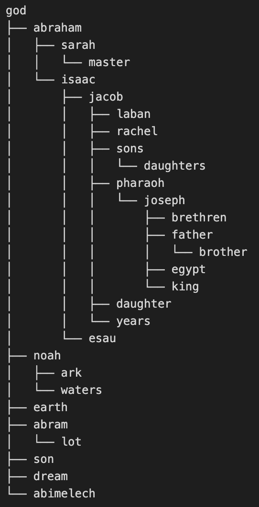

# Ontology hierarchy construction
This folder contains a method of generating ontological hierarchies.

The method consists of the following:
## preprocessing.py
Preprocessing and filtering functions based on `tf`, `tf_idf` and `nltk` for part-of-speech tagging. The final output of these functions is a dataframe of filtered-out words (options for exclusion of stopwords, verbs, determiners, pronouns, adverbs and numbers) together with their `tf`, `df` and `tf_idf` measures. The dataframe will be ordered with respect to the desired measure (default is `tf_idf`). From this dataframe, one can extract the `top_n_words` with respect to a desired measure and pass them onto the relation extractor.

## extract_relations.py
Given the filtered-out `top_n_words` and a list of all sentences of a corpus of text, the function `get_directed_relations` will extract directed relations between the words. The `top_n_words` do not need to come from the preprocessing functions. They can be chosen arbitrarily. 

The relations are found using SpaCy dependency tree parsing by extracting subject-object pairs, identifying negative relations, replacing pronouns, using conjunct subjects and so on. As a simple example, from the sentence 

"Then Jesus sent the multitude away, and went into the house." 

the relation extractor will extract two relations: the relation (Jesus->multitude) and, using a conjunct subject, the relation (Jesus->house). But from the following sentence

"No man hath seen God at any time."

the inverted relation (God->man) will be extracted due to the negative determiner attached to the word "man". One can say, that the relation extractor searches for action-oriented relations.

Before feeding the relations into the iterative hierarchy construction algorithm, the relations need to be ordered. To do this, the `order_directed_relations` function can be used with a number of options. As the hierarchy construction algorithm is iterative, the order of the relations given to it has a big impact on the outcome. It is advised to try out multiple settings combinations, there is not a one-fits-all solution. For more settings details, refer to the documentation of the respective functions.

## ontology_algorithm.py
A simple iterative hierarchy construction algorithm `construct_ontology_hierarchy`. Upon construction, the hierarchy is constantly checked for cycles. Additionally, there is a function `print_hierarchy_tree_from_ontology` which can print the hierarchy out: 

## Application examples
In two notebooks, application of the whole workflow is demonstrated. For both, we use the KJV Bible as the corpus of text:

- `genesis_ontology.py`: generation of a ontological hierarchy of key terms in Genesis. One can specify the `last_chapter` that will be included in the analysis and `n` as the number of key terms taken from the preprocessing.
- `whole_bible_ontology.ipynb`: generation of an ontological hierarchy of key terms in any set of books of the Bible. The set of books can be specified in the `chosen_books` variable and the number of key terms extraced in the `n` variable.